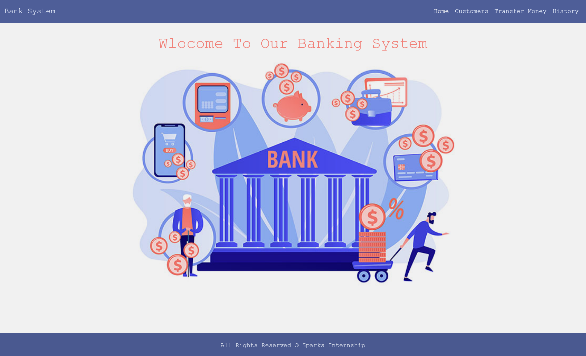
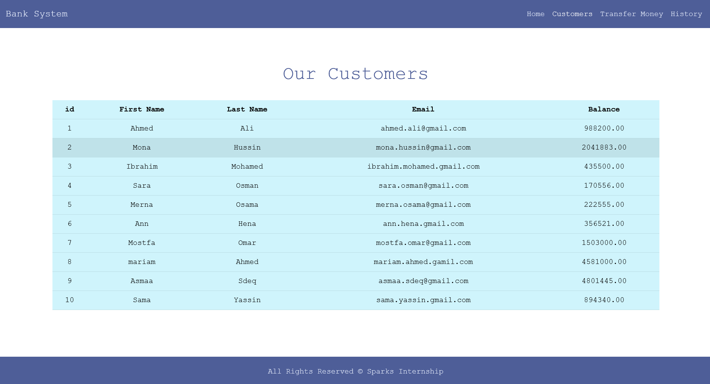
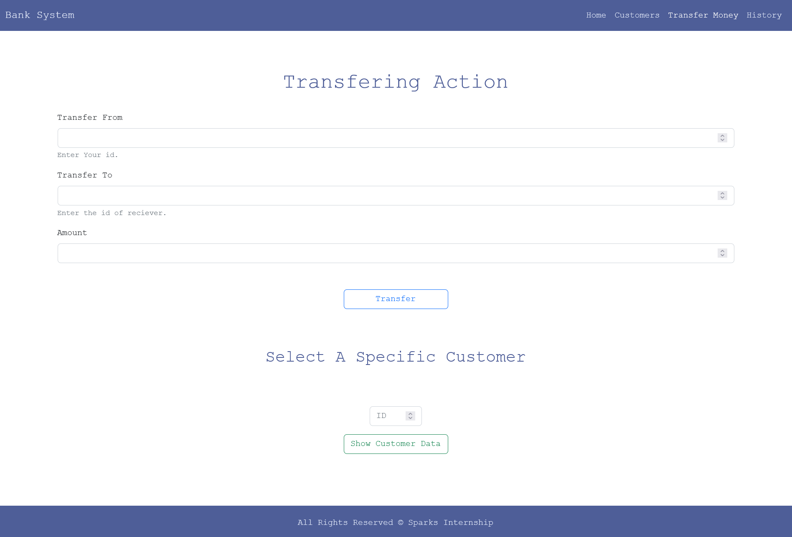
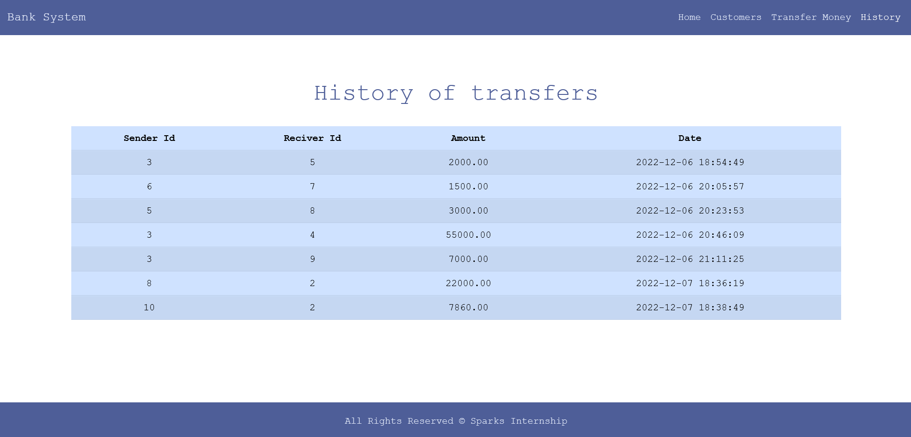

# Sparks Internship - basik banking system

This is a task of sparks foundation [the sparks foundation](https://internship.thesparksfoundation.info/). 

## Table of contents

- [Overview](#overview)
  - [Screenshot](#screenshot)
  - [Built with](#built-with)
  - [Useful resources](#useful-resources)
- [Author](#author)

## Overview

### the project contains four pages:
 <ol>
  <li>home page - welcome page</li>
  <li>customers page - shows all the customers in the system</li>
  <li>transfer money page - to transfer amount of money from user to anthor and to display the data of any user tou select</li>
  <li>history page - Displays the history of all transferring</li>
 
 </ol>

### to run this project :
  - clone this project
  - then you should create two tables in mysql database the customers table and the transfers table

### Screenshot

 

### Built with

- Semantic HTML5 markup
- Scss
- bootstrap
- php
- mysql
- [sweetalert2](https://sweetalert2.github.io/v9.html)

### Useful resources

- [stack overflow](https://stackoverflow.com/) - This helped me to fix the errors .
- [w3schools](https://www.w3schools.com/php/php_mysql_connect.asp) - This helped me to know the syntax of php

## Author

- [linkedin ](https://www.linkedin.com/in/asmaa-elfatayry/)
- [Frontend Mentor](https://www.frontendmentor.io/profile/asmaa-elfatayry)
